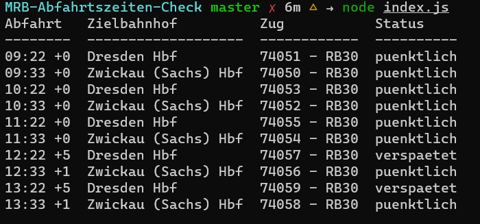
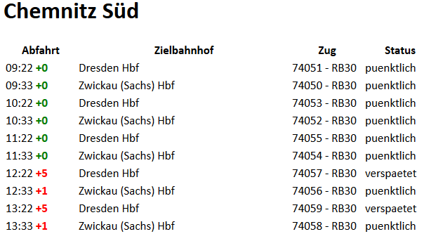

# MRB-Abfahrtszeiten-Check
Skript welches die Abfahrtszeiten eines angefahren Bahnhofes des MRB zurückliefert.

## Installation
Erstellen einer lokalen Arbeitskopie

`git clone https://github.com/TimmePfeife/MRB-Abfahrtszeiten-Check.git`

Installieren der Abhängigkeiten

`npm install`

Starten der Anwendung. Vorher müssen die Einstellungen in der [config.js](./config.js) angepasst werden.

`node index.js`

## Vorschau
### Konsole

### Email
